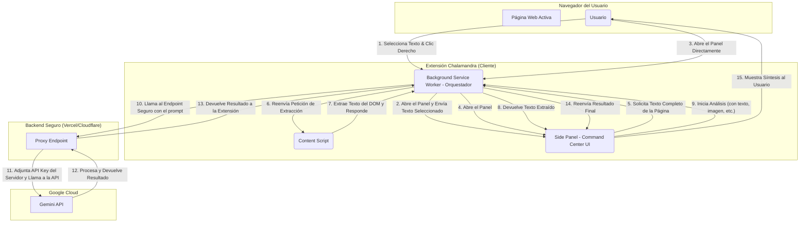

# CHALAMANDRA: IA Dialéctica Élite

**Protocolo Hegel-Trinity Multimodal sobre Manifest V3.**

Chalamandra es una extensión de navegador de clase mundial diseñada para transformar el consumo pasivo de información en un proceso activo de pensamiento crítico. Implementa un análisis dialéctico (Tesis, Antítesis, Síntesis) para deconstruir narrativas y aumentar la cognición del usuario.

---

### 🧠 Arquitectura y Flujo de Datos del Sistema

El sistema opera sobre una arquitectura desacoplada y segura, orquestada por un service worker y mediada por un proxy de backend para proteger las credenciales de la API.

### ✨ Características Principales

*   **Análisis Dialéctico de Texto:** Descompone cualquier texto seleccionado o página completa en Tesis, Antítesis y Síntesis.
*   **Protocolo Multimodal:** Capacidades para analizar imágenes (Visión) y audio (Live API).
*   **Grounding Geográfico:** Integra `geolocation` para análisis contextuales basados en la ubicación del usuario.
*   **Arquitectura Segura:** Las llamadas a la API de Gemini se realizan a través de un proxy de backend para nunca exponer las claves en el lado del cliente.
*   **UI Persistente:** Utiliza la API `sidePanel` de Chrome para un "Command Center" robusto y siempre accesible.

### 🛠️ Tech Stack

*   **Core:** Manifest V3, JavaScript (ESM)
*   **UI:** React (v19), TailwindCSS
*   **Backend:** Proxy sin servidor (Vercel, Cloudflare Workers)
*   **IA:** Google Gemini API (Pro, Nano, Veo)

### 🚀 Instalación para Desarrollo

1.  Clona este repositorio.
2.  Abre Chrome y ve a `chrome://extensions`.
3.  Activa el "Modo de desarrollador".
4.  Haz clic en "Cargar descomprimida" y selecciona la carpeta raíz del proyecto.