# CHALAMANDRA: IA Dialéctica

<div align="center">

</div>

**Análisis Dialéctico Avanzado con Google Gemini (Cloud & Nano)**

Chalamandra es una extensión y aplicación web que implementa un **Motor Hegel-Trinity** para analizar ideas, dilemas o contextos. Utiliza una arquitectura híbrida (Local-First con Fallback a Cloud) para procesar información a través de tres fases dialécticas.

## 🧠 Lógica del Motor Dialéctico

El sistema utiliza tres "personas" o modelos de procesamiento distintos para deconstruir y reconstruir la información:

1.  **Tesis (Chola):** Análisis inicial de patrones. Se ejecuta preferentemente en **Local** (Gemini Nano) para velocidad y privacidad.
2.  **Antítesis (Malandra):** Crítica detallada y búsqueda de contradicciones. Se ejecuta en **Cloud** (Gemini Pro/Flash).
3.  **Síntesis (Fresa):** Fusión estratégica y estructurada. Genera el resultado final en formato JSON.

### Diagrama de Flujo

```mermaid
sequenceDiagram
    autonumber
    participant User as 👤 Usuario
    participant UI as 🖥️ Interfaz (App)
    participant Orch as ⚙️ Orquestador
    participant Local as ⚡ Gemini Nano (Local)
    participant Cloud as ☁️ Gemini Pro (Cloud)

    Note over User, UI: Inicio del Protocolo
    User->>UI: Ingresa Texto / Selecciona Contexto
    User->>UI: Click "Ejecutar Motor"
    UI->>Orch: runDialecticAnalysis()

    rect rgb(35, 30, 20)
        Note over Orch, Cloud: FASE 1: TESIS (CHOLA)
        Orch->>Local: Solicitar Tesis (Prioridad Local)
        alt Local Disponible
            Local-->>Orch: Resultado Tesis
        else Fallo Local
            Orch->>Cloud: Fallback Tesis
            Cloud-->>Orch: Resultado Tesis
        end
    end

    rect rgb(40, 20, 40)
        Note over Orch, Cloud: FASE 2: ANTÍTESIS (MALANDRA)
        Orch->>Cloud: Solicitar Análisis Crítico
        Cloud-->>Orch: Resultado Antítesis
    end

    rect rgb(20, 40, 40)
        Note over Orch, Cloud: FASE 3: SÍNTESIS (FRESA)
        Orch->>Cloud: Solicitar Síntesis Estructurada (JSON)
        Cloud-->>Orch: Resultado Final {text, level, alignment}
    end

    Orch->>Orch: Actualizar Estadísticas y Hitos
    Orch-->>UI: Retornar Resultado Completo
    UI->>User: Visualización Dialéctica
```



## 🚀 Instalación y Ejecución

### Requisitos
- Node.js instalado.
- Una API Key de Google Gemini.

### Configuración Local

1.  **Instalar dependencias:**
    ```bash
    npm install
    ```

2.  **Configurar Entorno:**
    Crea un archivo `.env.local` en la raíz y añade tu clave:
    ```env
    GEMINI_API_KEY=tu_clave_aqui
    ```

3.  **Ejecutar la aplicación:**
    ```bash
    npm run dev
    ```

### Despliegue como Extensión de Chrome

1.  Genera el paquete de distribución (o usa el código fuente limpio).
2.  Ve a `chrome://extensions/`.
3.  Activa el **Modo Desarrollador**.
4.  Selecciona **Cargar descomprimida** (Load unpacked) y elige la carpeta del proyecto.

---
*Magistral Decox Systems &copy; 2025*
